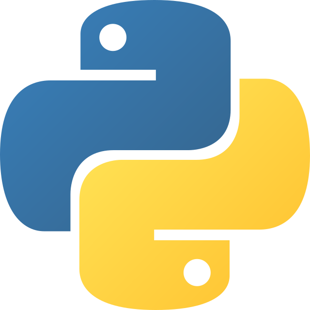

# Introducció a Python

## Què és Python?

**Python** és un llenguatge de programació de **molt alt nivell**, dissenyat per ser fàcil de llegir i escriure.  
Va ser creat per **Guido van Rossum** i llançat per primera vegada l’any **1991**. Python es destaca per la seva **simplicitat** i **llegibilitat**, utilitzant una sintaxi que permet als desenvolupadors expressar conceptes en menys línies de codi que altres llenguatges com C++ o Java.

{: style="display: block; margin-left: auto; margin-right: auto; width: 200px;" }

És un llenguatge interpretat, el que significa que el codi s'executa línia per línia, el que facilita la depuració i el desenvolupament ràpid.

---

## Breu història de Python

- **1991** – Guido van Rossum llança Python com a projecte per resoldre problemes en el desenvolupament de programari en el laboratori de la Centrum Wiskunde & Informatica (CWI) als Països Baixos.
- **1994** – Apareix la primera versió pública de Python.
- **2000** – L’última versió major de Python 2 és llançada. Python 2 continua sent usat fins als seus últims dies (2020).
- **2008** – Es llança Python 3, una versió incompatible amb Python 2, que va incloure millores significatives en la sintaxi i el rendiment.
!!! note "Atenció"
    - Quines implicacions creus que va tindre açò?
- **Actualitat** – Python és un dels llenguatges més populars per a la **ciència de dades**, la **intel·ligència artificial**, el **desenvolupament web** i moltes altres aplicacions.


{: style="display: block; margin-left: auto; margin-right: auto; width: 800px;" }

---

## Característiques de Python

- **Llenguatge de molt alt nivell**: Python està dissenyat per ser fàcil de llegir i escriure, semblant al llenguatge natural.
- **Sintaxi simple i clara**: Utilitza indentació per definir blocs de codi, cosa que elimina la necessitat de claus o parèntesis.
- **Gran biblioteca estàndard**: Python ve amb una àmplia col·lecció de biblioteques per a tot, des de la manipulació de fitxers fins a la creació d’aplicacions web i la gestió de bases de dades.
- **Interpretat**: Python és un llenguatge interpretat, el que vol dir que el codi es pot executar immediatament, sense necessitat de compilar-lo.
- **Portabilitat**: Python funciona en pràcticament tots els sistemes operatius modernes, des de Windows fins a Linux i macOS.
- **Multiplataforma**: Permet desenvolupar aplicacions per a diversos entorns, des de scripts de consola fins a aplicacions web.

---

## Què pots fer amb Python?

- **Desenvolupament web**: Frameworks com **Django** i **Flask** permeten crear aplicacions web ràpides i escalables.
- **Ciència de dades**: Biblioteques com **NumPy**, **Pandas**, **Matplotlib** i **Scikit-learn** permeten treballar amb grans volums de dades, realitzar anàlisis estadístiques i construir models d'aprenentatge automàtic.
- **Automatització**: Python és ideal per escriure scripts d’automatització que realitzen tasques repetitives com gestionar fitxers o enviar correus electrònics.
- **Intel·ligència artificial i aprenentatge automàtic**: Amb biblioteques com **TensorFlow**, **Keras** i **PyTorch**, Python és un llenguatge molt usat en el desenvolupament de models d’IA.
- **Aplicacions de línia de comandes**: Python és perfecte per escriure eines i aplicacions d’automatització per línia de comandes.
- **Desenvolupament de videojocs**: Python també es pot utilitzar per crear videojocs mitjançant biblioteques com **Pygame**.

---

## Avantatges de Python

- **Facilitat d’aprenentatge**: Python és un dels llenguatges més fàcils de començar a aprendre, gràcies a la seva sintaxi clara i senzilla.
- **Gran comunitat**: Existeix una enorme comunitat de desenvolupadors que contribueixen a biblioteques, eines i recursos d’aprenentatge.
- **Versatilitat**: Python es pot utilitzar per gairebé qualsevol tipus de desenvolupament, des de petites automatitzacions fins a grans sistemes de producció.
- **Codi net i llegible**: La sintaxi de Python promou el desenvolupament de codi net i estructurat, facilitant la mantenibilitat i la col·laboració.

---

## Què fa Python diferent?

A diferència d'altres llenguatges de programació, Python és un llenguatge molt **dissenyat per ser llegible**. Aquesta filosofia de **llegibilitat** fa que els programes Python siguin fàcils de seguir i entendre. A més, el fet que Python sigui un llenguatge **interpretat** i **dinàmic** el fa molt flexible per a diversos tipus d’aplicacions i desenvolupament ràpid.

---

## Exemple de codi en Python

Un dels exemples més senzills en Python seria un codi que imprimeix "Hola, món!" a la pantalla:

```python
# Exemple d'un programa simple en Python
print("Hola, món!")
```

Aquest codi fa servir la funció `print()`, que és una de les funcions integrades de Python que permet mostrar text a la pantalla.

---

## Python en el futur

Python continua sent un dels llenguatges de programació més usats i amb més creixement, especialment en camps com la **intel·ligència artificial**, la **ciència de dades**, el **desenvolupament web** i l’**automatització**. Les seves aplicacions continuen expandint-se, i es preveu que la seva popularitat segueixi creixent.

---

## Conclusió

Python és un llenguatge de programació molt potent i versàtil, ideal tant per a principants com per a professionals amb experiència. La seva **simplicitat**, **llegibilitat** i la gran quantitat de biblioteques disponibles el converteixen en una eina perfecta per a tot tipus de projectes, des de scripts petits fins a aplicacions complexes.

---

!!! note "Exercicis"
    Reflexiona sobre aquests conceptes i respon a les preguntes:

    1. Quina creus que seria la diferència entre un llenguatge de programació **interpretat** i un **compilat**? Creus que existeix un llenguatge "**hibrid**"?
    2. Imagina que vols escriure un programa que saluda una persona. Quins passos creus que hauries de seguir per dissenyar aquest programa? Explica-ho de manera senzilla.
    3. Què creus que passaria si no tinguessis una sintaxi clara i simple en un llenguatge de programació com Python?

---